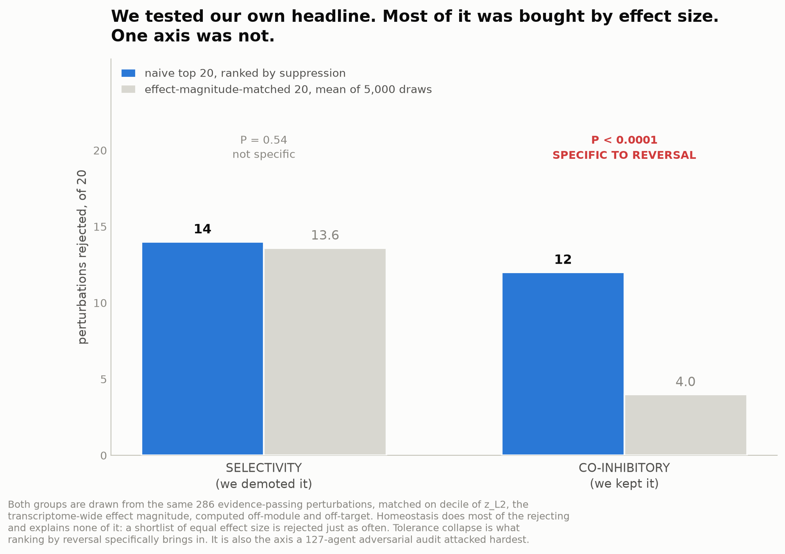
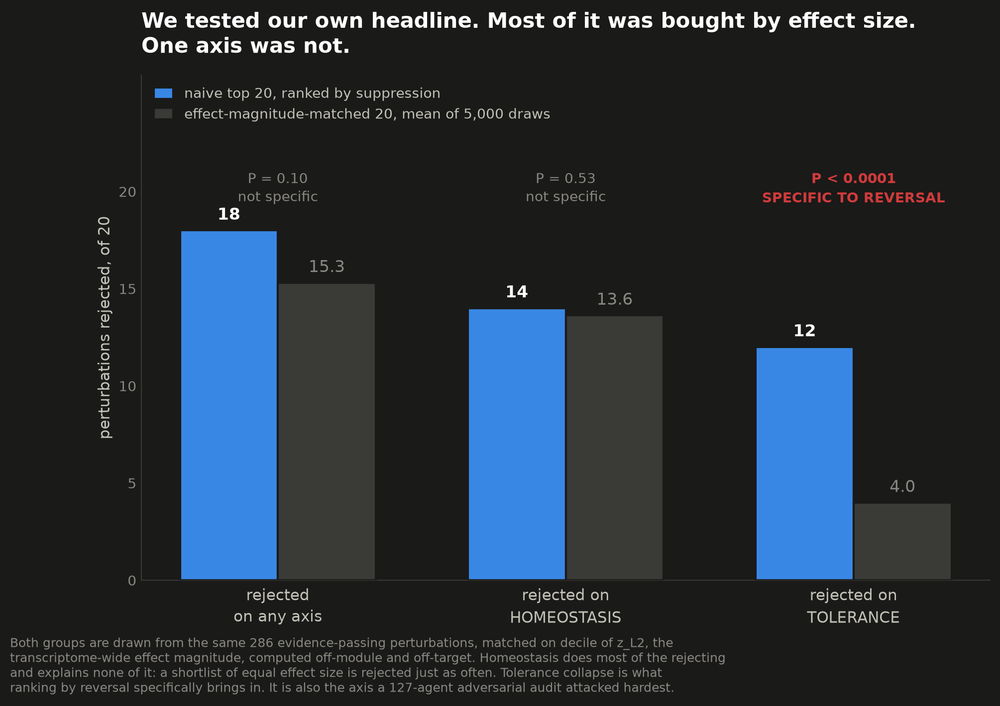

```{python}
#| tags: [setup]
import sys
from pathlib import Path

import matplotlib as mpl
import matplotlib.pyplot as plt
import numpy as np
import pandas as pd
from IPython.display import Markdown
from scipy import stats

# Figures 5 and 6 are drawn HERE, from the committed tables, rather than loaded as rasters produced by
# a separate script. A reader can click "Show the code" on each and see exactly which CSV column became
# which bar. Captions live in the Quarto `fig-cap`, never burned into the image.
PALETTE = {"ink": "#0b0b0b", "ink2": "#52514e", "muted": "#898781", "grid": "#e1e0d9",
           "axis": "#c3c2b7", "series": "#2a78d6", "recede": "#d8d7d0", "critical": "#d03b3b"}


def fig_style(ax, xgrid: bool = True, ygrid: bool = False) -> None:
    """Apply the report's house style to one matplotlib axis.

    Args:
        ax: The axis.
        xgrid: Draw the vertical grid.
        ygrid: Draw the horizontal grid.
    """
    for side in ("top", "right"):
        ax.spines[side].set_visible(False)
    for side in ("left", "bottom"):
        ax.spines[side].set_color(PALETTE["axis"])
    if xgrid:
        ax.grid(axis="x", color=PALETTE["grid"], linewidth=0.6, zorder=0)
    if ygrid:
        ax.grid(axis="y", color=PALETTE["grid"], linewidth=0.6, zorder=0)
    ax.tick_params(colors=PALETTE["muted"], labelsize=9, length=0)

REPO = Path.cwd().parent if Path.cwd().name == "reports" else Path.cwd()
sys.path.insert(0, str(REPO / "src"))

from cd4_perturbseq import priors  # noqa: E402

FIG = "../results/figures"

window = pd.read_csv(REPO / "results/tables/window_score.csv")
truth = pd.read_csv(REPO / "resources/ground_truth/immunomodulator_targets.csv")
pillars = pd.read_csv(REPO / "results/tables/magnitude_matched_pillars.csv")
strat = pd.read_csv(REPO / "results/tables/risk_kill_stratified_tests.csv")
spec = pd.read_csv(REPO / "results/tables/reversal_specificity.csv")
rivals = pd.read_csv(REPO / "results/tables/reversal_rival_rankings.csv")
funnel = pd.read_csv(REPO / "results/tables/selection_funnel.csv").set_index("stage")
# N9. The induction-matched module-level null. `scripts/10`'s per-perturbation p-value (3.5e-13) is
# anticonservative by orders of magnitude — it treats 6,371 z-values as independent when the module is
# one fixed nine-gene set, so the effective n is 1. It is never quoted; this table is quoted instead.
n9 = pd.read_csv(REPO / "results/tables/tolerance_induction_verdict.csv").iloc[0]
doe = pd.read_csv(REPO / "results/tables/direction_of_effect.csv")

# The correlation that bears on the tautology objection. This report used to quote only
# rho(z_L2, tolerance_loss) = 0.07 and let it imply the axes are independent. They are not: the
# efficacy axis IS suppression of the activation module, and the co-inhibitory genes are themselves
# activation-induced. Compute the honest number and print it next to the claim.
_ev = window[~window["fail_evidence"]]
RHO_EFF_TOL_ALL = float(stats.spearmanr(window["efficacy"], window["tolerance_loss"]).statistic)
RHO_EFF_TOL_EV = float(stats.spearmanr(_ev["efficacy"], _ev["tolerance_loss"]).statistic)
N_EVIDENCE_PASS = int(len(_ev))

# Never restate these as literals. The prose used to say "only 217 of 682"; that went stale the day
# 11_selection_funnel.py stopped unioning two gene-symbol vocabularies to build its denominator, and
# nothing failed. Every count below is read from the committed table.
LIB_CEG = int(funnel.loc["in sgRNA library", "essentials"])
DE_CEG = int(funnel.loc["reaches DE_stats", "essentials"])
LIB_NEG = int(funnel.loc["in sgRNA library", "nonessentials"])
QC_NEG = int(funnel.loc["+ not low_target_gex", "nonessentials"])
N_LIBRARY = int(funnel.loc["in sgRNA library", "all_library"])

schmidt = priors.schmidt_cd4_il2_screen()
w = window.merge(schmidt, on="gene_name", how="left")
w["il2_hit"] = (w["il2_neg_fdr"] < 0.05) & (w["il2_lfc"] < 0)
w["naive_rank"] = (-w["eff_mean_z"]).rank(ascending=False, method="first")
assert w.loc[w["naive_rank"].idxmin(), "eff_mean_z"] == w["eff_mean_z"].min(), "rank direction inverted"

N_RANKABLE = len(window)
N_TOP20_REJECTED = int((~w.nsmallest(20, "naive_rank")["safe"]).sum())
POSITIVES = truth[truth["include_as_positive"]]["gene_symbol"]


def spec_row(quantity: str) -> pd.Series:
    """Pull one row of the reversal-specificity table by its `quantity` label.

    Raises on an unknown label rather than returning an empty frame. The report once asked for
    `"rejected on homeostasis"`, a row the N6b rebuild had renamed to `"fails selectivity
    annotation"`, and the render died with an opaque IndexError. A table that changes shape should
    fail the render loudly, the way `_assert_no_dead_axis` does in `scripts/05_figures.py`.
    """
    hit = spec[spec["quantity"].str.startswith(quantity)]
    if hit.empty:
        raise KeyError(
            f"reversal_specificity.csv has no row starting with {quantity!r}. "
            f"Available: {sorted(spec['quantity'])}"
        )
    return hit.iloc[0]


PRIMARY = strat[
    (strat["stratification"].str.startswith("stratified on z_l2"))
    & (strat["test"] == "tolerance suppression")
].iloc[0]
TOL = spec_row("rejected on tolerance")
# The homeostasis axis was demoted to a reported annotation by N6b. The row is named for what it is.
SEL = spec_row("fails selectivity annotation")
ANY = spec_row("rejected (any axis)")


def _assert_abstract_is_current() -> None:
    """Fail the render if the YAML abstract has drifted from the committed tables.

    The abstract is YAML and cannot host inline Python, so its numbers are the only literals in this
    document. They are therefore the only ones that can rot silently. This pins each of them to the
    table it came from. If a pipeline rerun moves a number, the render dies here rather than shipping
    a paper whose abstract disagrees with its own results.
    """
    claims = {
        "top-20 rejected": (int(ANY["observed"]), 12),
        "matched expectation": (round(float(ANY["matched_mean"]), 1), 4.0),
        "selectivity flags": (int(SEL["observed"]), 14),
        "selectivity matched": (round(float(SEL["matched_mean"]), 1), 13.6),
        "selectivity P": (round(float(SEL["p_matched_ge_observed"]), 2), 0.54),
        "N9 module-level p": (round(float(n9["p_module_level"]), 3), 0.005),
        "N9 co-regulated-null p": (round(float(n9["p_module_level_coregulated_quartile"]), 4), 0.0196),
        "direction-unmeasured genes": (int((doe["direction_verdict"] == "UNKNOWN").sum()), 191),
        "screen-passing genes": (int(window["safe"].sum()), 214),
    }
    drift = {k: v for k, v in claims.items() if v[0] != v[1]}
    if drift:
        raise ValueError(
            "The abstract is stale. Recompute it from the tables. "
            + "; ".join(f"{k}: table says {a}, abstract says {b}" for k, (a, b) in drift.items())
        )


_assert_abstract_is_current()


def _provenance() -> str:
    """Render-time provenance: when this document was built, and from which commit.

    A rendered report that names its own commit is checkable. A reader can run
    `git checkout <sha> && quarto render` and get this document back. If the working tree was dirty
    at render time, say so, because then the commit alone does not reproduce it.

    Returns:
        A Markdown line for the top of the report.
    """
    import subprocess
    from datetime import datetime, timezone

    def _git(*args: str) -> str:
        try:
            return subprocess.run(["git", *args], cwd=REPO, capture_output=True, text=True,
                                  timeout=10, check=True).stdout.strip()
        except Exception:  # noqa: BLE001 - provenance must never break a render
            return ""

    sha = _git("rev-parse", "--short", "HEAD") or "unknown"
    # Ignore this document itself. `reports/report.html` is tracked, and rendering rewrites it, so it
    # is always dirty at the moment the render asks. The question that matters is whether any SOURCE
    # or TABLE is uncommitted, because that is what would make the named commit fail to reproduce
    # these numbers.
    changed = [line[3:] for line in _git("status", "--porcelain").splitlines() if line[3:]]
    dirty = [f for f in changed if not f.startswith("reports/report.html")]
    stamp = datetime.now(timezone.utc).astimezone().strftime("%Y-%m-%d %H:%M:%S %Z")
    state = (f" · ⚠ **{len(dirty)} uncommitted source or table change(s) at render time**, so this "
             f"commit alone does not reproduce this document: `{'`, `'.join(sorted(dirty)[:4])}`"
             + (" …" if len(dirty) > 4 else "")) if dirty else ""
    return (f"::: {{.callout-note appearance='minimal'}}\n"
            f"Rendered **{stamp}** from commit `{sha}`{state}. Every number below is read from a "
            f"committed table in `results/tables/`; `scripts/30_pvalue_genealogy.py` fails if any of "
            f"them has drifted.\n:::")
```

```{python}
Markdown(_provenance())
```

# Introduction

A genome-scale CRISPRi Perturb-seq screen in primary human CD4+ T cells now exists, covering
`{python} f"{window['gene_name'].nunique():,}"` analysable perturbed genes across resting,
8-hour and 48-hour stimulated conditions. The obvious way to mine it for drug targets is to
rank perturbations by how strongly they reverse a disease signature. The authors have already
released a model that does this.

That approach has a failure mode that its own metrics cannot see. An essential gene whose
knockdown is cytotoxic also collapses an inflammatory signature, so it looks like a hit. So does
a gene at the heart of the T cell receptor, whose loss in a human being causes severe combined
immunodeficiency rather than remission. **Reversal is not enough.** The interesting object is not
the ranking; it is the gate that separates a drug target from a gene you must not touch.

Saying so is cheap. The hard part, and the part we spend @sec-magnitude on, is showing that the gate
is catching something a reversal ranking *specifically* brings in, rather than something any ranking
by effect size would bring in. Most of it turns out to be the latter. One axis is not.

Our contribution is the decision layer, and it is a **triage and abstention layer**, not a
safety-gated shortlist. The assay measures mRNA in one in-vitro CD4 stimulation. It cannot see
therapeutic safety, tolerance, Treg function, infection risk, malignancy risk, or a dose window. What
it can support is a triage score built only from what the screen measures, a set of **screen-internal
safety proxies** kept because the data supports them rather than because a database exists, a test of
whether each axis is about the direction of a perturbation or merely its size, an honest account of
what the assay cannot see, and a rule for when to **refuse to nominate at all**.

# Methods

## Data

We use the released per-perturbation effect matrix, `GWCD4i.DE_stats.h5ad`, holding 33,983
perturbation-by-condition pairs across 10,282 measured genes. Raw cells are not reprocessed.
Prior gene lists and reference screens come from the source paper's analysis repository.

After routine perturbation QC (dropping distal off-target and neighbouring-gene knockdown flags,
requiring significant on-target knockdown, and dropping low baseline target expression),
`{python} f"{N_RANKABLE:,}"` stimulated perturbations remain analysable.

## The activation program, and why the co-inhibitory module is scored apart from it

The effector module is built from two independent sources: a curated immune effector list, and
genes significantly induced in an external bulk RNA-seq stimulation contrast. Only genes
supported by both enter the high-confidence core.

`FOXP3`, `IL10`, `IKZF2` and the co-inhibitory checkpoints are also induced by stimulation.
Suppressing them is a liability, not a benefit. They are therefore removed from the objective and
scored separately as an **activation-induced co-inhibitory module** whose suppression is penalised.

## The triage score

Three requirements, applied in order. A fourth, immune essentiality, was removed; see @sec-failures.

1. **Evidence floor.** A perturbation must significantly suppress at least three effector-module
   genes at 10% FDR. Without it, perturbations that did nothing dominate the ranking, as
   @sec-failures shows.
2. **Context selectivity.** The stimulated effect must exceed the resting effect at least
   tenfold, measured in significant DE-gene counts. This threshold is fixed a priori.
3. **Co-inhibitory preservation.** Perturbations in the top quartile of co-inhibitory module
   suppression are rejected. The module is suppressed beyond a null matched on both expression
   **and induction**: against `{python} f"{int(n9['n_modules'])}"` random nine-gene modules matched
   on both, the real module reaches T = `{python} f"{n9['T_real']:.2f}"` while the largest matched
   module reaches only `{python} f"{n9['T_null_max']:.2f}"`; module-level permutation
   p = `{python} f"{n9['p_module_level']:.3f}"` (n = 1 module, not 100 perturbations). Co-induction
   accounts for `{python} f"{n9['coinduction_share_of_scripts10_effect']:.0%}"` of the effect an
   expression-matched null had reported. An earlier per-perturbation p-value of 3.5e-13 treated
   6,371 z-values as independent when the module is a single fixed nine-gene set; it was
   anticonservative by orders of magnitude and is not quoted anywhere in this report.

Immune essentiality from the IUIS list is **reported, not gated on**, and the reason is in
@sec-failures.

For every perturbation, the perturbed gene is removed from both its own module and the
background, because its on-target knockdown is large, negative, and required to be significant by
QC. Twenty-one effector genes are themselves perturbed in this library, so this is not
hypothetical.

**Viability is read off the screen, not a database.** Cells carrying a guide against a gene the
cell cannot live without are simply absent. Hart core-essential genes are measurably depleted at
rest in this data, so resting cell count is the context-free viability signal. Depletion *only*
under stimulation is antiproliferation, which is mycophenolate's mechanism rather than a
disqualification, so viability is reported as a tier and does not reject.

## Stratified inference, and one pre-registered endpoint

Enrichment of a liability in the top of a ranking is tested against a background **stratified** on
the confounding covariate, using every control row. Binary flags use the Cochran-Mantel-Haenszel
test; continuous measures use van Elteren's stratified rank-sum with $1/(n+1)$ weights. Neither
draws a random number. Both are hand-rolled in `src/cd4_perturbseq/stratified.py` and validated
against scipy, against a 20,000-draw within-stratum permutation null, and against 400 simulated
nulls for type-I calibration.

This replaces an earlier design that sampled one 100-row matched background with `seed=0`,
discarding 6,171 of 6,271 usable controls. Redrawing that design 2,000 times moves the odds ratio
over [1.72, 14.79] and the p-value over [0.00064, 0.178], with 22.4% of seeds landing above 0.05.

The confounder is **not** cell count. `Spearman(n_cells_target, stim_de_genes) = -0.243`: more cells
means *fewer* differentially expressed genes, so cell count is a viability readout and matching on it
controlled the confound backwards. The confounder is panel-wide effect magnitude, and the
background is stratified on its decile.

The risk-kill script decides on **one pre-registered primary endpoint**, not on `any()` of five
one-sided tests, which would carry a family-wise false-positive rate near 23%:

> Tolerance-module suppression is higher in the naive top 100 than in the $z_{L2}$-decile-stratified
> background. One-sided van Elteren, $\alpha = 0.05$.

It is chosen structurally rather than by p-value: it is the only pillar that is both an axis the gate
rejects on and a graded screen-native measure rather than a count of DE genes. Permuting the
tolerance column, or flipping its sign, makes the script exit 1. The remaining four tests are
secondary and Benjamini-Hochberg corrected, and they decide nothing.

## Validation discipline

The Schmidt and Steinhart 2022 genome-wide CRISPRi screen for CD4+ IL-2 production is a different
lab, a different assay, and a protein readout rather than a transcriptome. It is **held out**. It
never enters the score, the gate, or any threshold. Every number involving it is out of sample.

# Results

## A naive reversal ranking returns perturbations the triage layer refuses

```{python}
top20 = w.nsmallest(20, "naive_rank")
Markdown(
    f"Of the top 20 perturbations by naive effector suppression, **{N_TOP20_REJECTED} are "
    f"rejected** by the triage layer. The survivors are "
    + (", ".join(f"`{g}`" for g in top20.loc[top20["safe"], "gene_name"]) or "none")
    + ", and each needs checking by hand: a gate is not a proof."
)
```

::: {.panel-tabset}

### The ranking

::: {.light-content}
{#fig-naive}
:::
::: {.dark-content}
{#fig-naive-dark}
:::

### They really work

::: {.light-content}
{#fig-rejected}
:::
::: {.dark-content}
{#fig-rejected-dark}
:::

### The rejected list

```{python}
rejected = w[w["il2_hit"] & ~w["safe"] & ~w["fail_evidence"]].sort_values("il2_lfc")
show = rejected[["gene_name", "stim_de_genes", "rest_de_genes", "il2_lfc", "reject_reason"]]
show.columns = ["gene", "DE genes (stim)", "DE genes (rest)", "IL-2 log2FC", "rejected for"]
show.round(2)
```

:::

The contaminants are of two kinds. Immune-essential signalling machinery: `STAT5B`, `VAV1`,
`IL2RB`, `CD3G`, `CD247`, `LCK`. And global transcription machinery that collapses the resting
transcriptome: `NSD1` (2,175 DE genes in stimulated cells and 1,767 at rest), `TADA2B` (5,260 and
4,681), `USP22` (1,849 and 1,783), `WDR82` (1,563 and 1,253), `CXXC1` (853 and 536).

Crucially, these are not false positives in the sense of being wrong about efficacy.

```{python}
schmidt_rejected = w[w["il2_hit"] & ~w["safe"] & ~w["fail_evidence"]].sort_values("il2_lfc")
n_tol_only = int((schmidt_rejected["reject_reason"] == "tolerance").sum())
n_iei_rej = int(schmidt_rejected["is_iei"].sum())
Markdown(
    f"The held-out Schmidt screen confirms that **{len(schmidt_rejected)}** of the knockdowns this gate "
    f"refuses genuinely reduce IL-2 protein: "
    + ", ".join(f"`{g}`" for g in schmidt_rejected["gene_name"])
    + f". They work. **{n_tol_only} of them are refused for collapsing tolerance alone.** "
    f"{n_iei_rej} of the {len(schmidt_rejected)} are IUIS immunodeficiency genes — a reported annotation, "
    "never a gate, for the reason given in @sec-failures. `VAV1` and `PLCG1` are not IUIS genes at all, and "
    "`PLCG1` is listed there only as a gain-of-function disease, which loss-of-function CRISPRi cannot mimic."
)
```

Note what is *not* here. `CD3E`, `CD28` and `PTPRC` are Schmidt-confirmed IL-2 hits and IUIS
immunodeficiency genes, and this gate **passes all three**. A gate anchored on the immunodeficiency
list would have rejected them, and it would have been wrong to.

## Most of that number is bought by effect size {#sec-magnitude}

The sentence above is the one a reader remembers, so it is the one that deserves the hardest test.
A perturbation that moves the whole transcriptome gets a large mean z-score over *any* gene set,
the effector module included, and it crosses the differential-expression threshold on many genes
for the same reason. If that is all that is happening, "reversal is not enough" reduces to
"large-effect knockdowns are toxic", which is neither new nor about reversal.

So we measured panel-wide effect magnitude directly, as
$z_{L2} = \sqrt{\sum_g z_g^2}$ over all 10,282 measured genes, excluding the perturbed gene's own
column and both module gene sets so that the covariate cannot contain the score. Then we drew 5,000
shortlists of 20 from the same evidence-passing pool, matched to the naive top 20 on $z_{L2}$
decile, and asked the gate to judge them.

::: {.panel-tabset}

### The control

::: {.light-content}
{#fig-magnitude}
:::
::: {.dark-content}
{#fig-magnitude-dark}
:::

### The numbers

```{python}
tbl = spec[["quantity", "observed", "matched_mean", "p_matched_ge_observed"]].copy()
tbl.columns = ["quantity", "naive top 20", "magnitude-matched mean", "P(matched ≥ observed)"]
tbl["magnitude-matched mean"] = tbl["magnitude-matched mean"].round(1)
tbl["P(matched ≥ observed)"] = tbl["P(matched ≥ observed)"].map(lambda p: "< 0.0001" if p == 0 else f"{p:.3f}")
tbl
```

:::

```{python}
Markdown(
    f"The aggregate count is not specific to reversal. A shortlist of the same effect magnitude is "
    f"rejected **{ANY['matched_mean']:.1f}** times out of 20 against our **{int(ANY['observed'])}**, "
    f"P = {ANY['p_matched_ge_observed']:.3f}. Our headline number buys about "
    f"{ANY['observed'] - ANY['matched_mean']:.1f} rejections over effect size alone."
)
```

Decomposed by axis, the picture is not the one we expected. **Selectivity**, the axis we originally
called homeostasis, flags `{python} f"{int(SEL['observed'])}"` of our top 20 and
`{python} f"{SEL['matched_mean']:.1f}"` of a magnitude-matched 20
(P = `{python} f"{SEL['p_matched_ge_observed']:.2f}"`, n = 20). It carries no information beyond
effect magnitude, and N6 demoted it from a gate axis to a reported annotation on that basis.
**The co-inhibitory module** rejects `{python} f"{int(TOL['observed'])}"` of ours against
`{python} f"{TOL['matched_mean']:.1f}"` matched, P < 0.0001, n = 20. It is the only axis that is
about the *direction* of a perturbation rather than its *size*.

The pillar-level statistics say the same thing. Against a background stratified on $z_{L2}$
decile, using every control row rather than one sampled draw:

```{python}
p = pillars[pillars["registered"]][["pillar", "rho_with_z_l2", "A_effect", "A_p_bh", "B_effect", "B_p_bh", "B_stable"]].copy()
p.columns = ["pillar", "ρ with z_L2", "A: vs matched bg", "A p (BH)", "B: vs induction", "B p (BH)", "B stable?"]
p["B stable?"] = np.where(p["B stable?"], "yes", "**fragile**")
p.round(3)
```

Test A compares the top 100 to a magnitude-matched background. Test B compares it to the top 100
ranked by *induction* of the same module: the sign-flipped control. A pillar that fires on both
tails measures magnitude, not suppression. Collateral DE is 0.72 rank-correlated with $z_{L2}$ and
its direction-specificity is fragile, surviving at ten strata and dying at twenty. Resting DE does
not survive test B at all. The co-inhibitory module is 0.07 correlated with magnitude, and
perturbations that *induce* the effector program *induce* it rather than suppressing it.

::: {.callout-warning title="The two axes are not independent, and an earlier draft implied they were"}
That $\rho = 0.07$ is the correlation with **panel-wide magnitude** $z_{L2}$, and quoting only it
invites the reading that the efficacy and co-inhibitory axes are orthogonal. They are not. The
efficacy axis *is* suppression of the activation module, and the co-inhibitory receptors are
themselves activation-induced, so the correlation that bears on the objection is between efficacy and
co-inhibitory loss:
`{python} f"Spearman = {RHO_EFF_TOL_ALL:+.3f}"` across all
`{python} f"{N_RANKABLE:,}"` rankable perturbations, rising to
`{python} f"{RHO_EFF_TOL_EV:+.3f}"` among the `{python} f"{N_EVIDENCE_PASS}"` that clear the evidence
floor, which is `{python} f"{RHO_EFF_TOL_EV**2:.1%}"` of shared rank variance. A reader is entitled
to ask whether the gate simply rejects the most efficacious perturbations.

The control that answers it is @sec-induction, and it answers it by holding the perturbation set
fixed and varying the *module* instead. If co-inhibitory loss were nothing but activation amplitude,
any equally-induced module would fall equally in the same top-100 perturbations. It does not.
:::

Finally, rankings that never mention the effector program:

```{python}
r = rivals.copy()
if len(r.columns) != 6:
    raise ValueError(f"reversal_rival_rankings.csv changed shape: {list(r.columns)}")
r.columns = ["ranking", "median tolerance loss", "median z_L2", "rejected on tolerance",
             "fails selectivity (annotation)", "pass gate"]
r.round(3)
```

Our ranking finds *more* tolerance collapse (0.54) at *lower* transcriptome disruption (z_L2 141)
than a pure-magnitude ranking does (0.29 at 179). The sign-blind ranking is identical to ours
because the evidence floor already removes inducers; it is a weak null and we report it as one.

**What survives.** "Reversal is not enough" stands: a practitioner who ranks by reversal and acts on
the top 20 will act on `{python} f"{N_TOP20_REJECTED}"` targets this gate refuses. But the
*mechanism* we asserted, collateral transcriptional damage, is largely a restatement of effect size.
The mechanism that survives every control is collapse of the co-inhibitory module. That is the
claim, and it is the one the pre-registered primary endpoint of
`scripts/02_risk_kill_reversal.py` tests: one-sided van Elteren,
z = `{python} f"{PRIMARY['effect']:.2f}"`, p = `{python} f"{PRIMARY['p']:.1e}"`.

## The module survives a null matched on induction, and on co-regulation {#sec-induction}

The objection above has a sharp form. Both modules are stimulation-induced, so a perturbation that
blunts activation must reduce both. The test that separates them holds the **perturbation set fixed**
— the top 100 by efficacy — and varies the **module**. If co-inhibitory loss were nothing but
activation amplitude, a random nine-gene module matched on expression and on induction would fall
just as far in those same perturbations.

```{python}
Markdown(f"""
| quantity | value |
|---|---|
| real module, median $z$ in the naive top 100 | **{n9['T_real']:+.3f}** |
| largest of {int(n9['n_modules'])} expression- and induction-matched null modules | {n9['T_null_max']:+.3f} |
| median matched null | {n9['T_null_median']:+.3f} |
| module-level permutation $p$ | **{n9['p_module_level']:.4f}** |
| positive control: the effector module itself | {n9['T_effector_positive_control']:+.3f} |
| negative control: false-positive rate on random modules | {n9['loo_fpr_module_level']:.3f} |
| co-induction's share of the effect an expression-only null reported | {n9['coinduction_share_of_scripts10_effect']:.1%} |
""")
```

**The effect is attenuated by this control, not eliminated.** An expression-matched null overstated it,
and co-induction accounts for
`{python} f"{n9['coinduction_share_of_scripts10_effect']:.0%}"` of what that null reported.
The effective unit is **one module**, not 100 perturbations. A per-perturbation Mann-Whitney over the
6,371 $z$ values gives `{python} f"{n9['mwu_p_void']:.2g}"`; its false-positive rate on random modules
is `{python} f"{n9['mwu_fpr_per_perturbation']:.0%}"`, so that p-value is anticonservative by orders of
magnitude and is **retracted**, here and everywhere.

**And one confound remains open.** The nine genes are co-regulated checkpoints, and co-regulation
inflates the statistic: across the null modules, mean gene-gene correlation predicts the statistic
(Spearman `{python} f"{n9['spearman_rhobar_vs_T_null']:+.3f}"`,
p = `{python} f"{n9['spearman_rhobar_vs_T_null_p']:.4f}"`). The real module's mean correlation is
`{python} f"{n9['rho_bar_real']:.4f}"`, **higher than every one of the
`{python} f"{int(n9['n_modules'])}"` nulls** (largest `{python} f"{n9['rho_bar_null_max']:.4f}"`).
Restricting the null pool to the co-regulated quartile therefore weakens the result, and we report the
weakened number as the honest one: **p = `{python} f"{n9['p_module_level_coregulated_quartile']:.4f}"`**.
It is a limitation, not a refutation, and it is stated before the result rather than after it.

## A triage layer that recovers known pharmacology but abstains from novel nomination {#sec-drugs}

```{python}
drugs = w[w["gene_name"].isin(POSITIVES) & ~w["fail_evidence"]].copy()
lookup = truth.set_index("gene_symbol")["drug_examples"].str.split(";").str[0]
drugs["drug"] = drugs["gene_name"].map(lookup)
cols = ["gene_name", "drug", "rest_cells_ratio", "viability_tier", "safe", "reject_reason"]
out = drugs[cols].sort_values("rest_cells_ratio", ascending=False).round(2)
out.columns = ["gene", "approved drug", "resting cells (x median)", "viability tier", "passes gate", "rejected for"]
out
```

::: {.panel-tabset}

### Gate geometry

::: {.light-content}
{#fig-gate}
:::
::: {.dark-content}
{#fig-gate-dark}
:::

### Held-out validation

```{python}
from sklearn.metrics import roc_auc_score

have = w["il2_lfc"].notna()
labels = w.loc[have, "il2_hit"].to_numpy()
rows = []
for label, col, sign in (("naive, -mean(module z)", "eff_mean_z", -1.0),
                         ("efficacy, -mean(module lfc)", "efficacy", 1.0),
                         ("window score", "window_score", 1.0)):
    values = np.nan_to_num(w.loc[have, col].to_numpy() * sign)
    rows.append({"score": label, "AUROC vs Schmidt IL-2 hits": round(roc_auc_score(labels, values), 3)})
pd.DataFrame(rows)
```

The window score does not beat the naive score here, and it must not. Schmidt's hits *are* the
TCR signalosome, which the gate rejects on purpose. Drug-target recovery and the Schmidt screen
validate the **efficacy axis**. Neither can validate the **window score**. A window score that
won those comparisons would be a window score that had stopped gating.

:::

```{python}
# The clinical tolerability classes are OURS, assigned from the label and not present in any
# committed table. Stated here rather than buried, because the 3-of-3 and 1-of-2 counts below
# depend on them entirely.
WELL_TOLERATED = ["PPP3R1", "IL4R", "IMPDH2"]
NARROW_INDEX = ["CD3E", "CD3G"]

gate = w.set_index("gene_name")
wt_pass = [g for g in WELL_TOLERATED if bool(gate.loc[g, "safe"])]
ni_pass = [g for g in NARROW_INDEX if bool(gate.loc[g, "safe"])]
passing_drugs = drugs.loc[drugs["safe"], "gene_name"].tolist()
rejected_drugs = {r["gene_name"]: r["reject_reason"] for _, r in drugs.loc[~drugs["safe"]].iterrows()}

Markdown(
    f"Five approved-drug targets clear the evidence floor. The gate passes "
    + ", ".join(f"`{g}`" for g in passing_drugs)
    + ". It rejects "
    + ", ".join(f"`{g}` for {r.replace('homeostasis', 'disrupting the resting arm').replace('tolerance', 'collapsing tolerance')}"
                for g, r in rejected_drugs.items())
    + f".\n\nWell-tolerated agents passing the gate: **{len(wt_pass)} of {len(WELL_TOLERATED)}**. "
    f"Narrow-index agents passing: **{len(ni_pass)} of {len(NARROW_INDEX)}**. "
    "Five points is a direction, not a p-value, and we report it as one."
)
```

`IMPDH2` is depleted at rest, and for mycophenolate that depletion *is* the mechanism. Viability is
therefore a reported tier and never rejects, because this screen cannot tell antiproliferation from
toxicity.

That second number was 0 of 2 until 2026-07-08, when the immunodeficiency flag was removed from the
gate. It had to go: the flag is more enriched among approved drug targets than among the
perturbations the naive ranking calls toxic, so it could not separate a hazard from a target.
`CD3E` now passes, and so do `CD28` and `PTPRC`. The screen-native axes cannot see cytokine release
syndrome, which is why muromonab was withdrawn and why `CD3E` passing is a limitation of the gate
rather than a triumph of it. We report the weaker number, and the reason it is weaker.

## Where the designs failed {#sec-failures}

Four designs failed before this one worked, and the failures are more informative than the pass.
The fourth is not a design failure but an explanation failure, and it is the most instructive.

**We asserted a mechanism and it was wrong.** We said a naive reversal ranking is toxic because it
nominates perturbations that cause collateral transcriptional damage. Collateral DE-gene count is
0.72 rank-correlated with panel-wide effect magnitude, and a magnitude-matched shortlist is
rejected almost as often as ours (@sec-magnitude). The claim was true and the reason was not.

That is the third mechanism this project asserted and then refuted. The first was that cancer-cell
essentiality is the wrong safety axis for this screen, withdrawn once the selection was measured
against the true library denominator. The second was that immunodeficiency-gene membership marks a
hazard, withdrawn once we noticed the flag is *more* enriched among approved drug targets than among
the perturbations the naive ranking calls toxic. A fourth mechanism, the audit's claim that the
tolerance axis is tautological, was refuted against 200 expression-matched random modules and stands
rejected. Each refutation cost a number we liked.

**No evidence floor.** Of the `{python} f"{N_RANKABLE:,}"` QC-passing perturbations,
`{python} f"{int((window['stim_de_genes'] <= 5).sum()):,}"` have five or fewer significant DE
genes genome-wide, and among those the maximum number of effector-module genes significantly down
is one. Ranking by a mean of z-scores let those perturbations dominate: `CAST` reached a score of
1.19 on two significant DE genes.

**Calibration was the wrong lever.** We hypothesised that co-regulation among effector genes
inflated the naive mean, and applied a CAMERA variance inflation factor. Estimated across all
perturbations the correlation is near zero; estimated among the 713 active perturbations it is
0.108. Either way the correction is near-uniform and barely reorders anything. Held-out AUROC went
from 0.701 to 0.689. It made things slightly worse. It is reported because it is honest.

**A collateral cap was backwards.** Capping the number of DE genes in stimulated cells rejects
precisely the context-selective targets this project exists to find. `ITK` carries 2,566 DE genes
in stimulated cells and 2 at rest. `PPP3R1` carries 523 and 1. Meanwhile `NSD1` carries 2,175 and
1,767. The discriminator is disruption **at rest**, never breadth in stimulated cells.

## Why calcineurin looked absent

`PPP3CA` produces one significant DE gene. `PPP3CB` produces three. Both are the target of
ciclosporin and tacrolimus, and both appear inert. `PPP3R1`, the obligate regulatory subunit,
produces 523.

The catalytic subunits are paralogues and compensate for one another. Single-gene CRISPRi cannot
see a redundant target. The shared, non-redundant regulatory subunit shows the phenotype. Any
drug-target-recovery benchmark on this data that does not account for redundancy will report a
false negative and blame the method.

# The nomination layer, and why it abstains {#sec-nomination}

## Every denominator, in one place

This report quotes many counts. They are not interchangeable, and two of them are actively misleading
unless stated. `scripts/31_denominator_manifest.py` recomputes each from its source and fails if one
has moved.

```{python}
den = pd.read_csv(REPO / "results/tables/denominator_manifest.csv")
d = den[["universe", "n", "meaning"]].copy()
d["n"] = d["n"].map(lambda x: f"{x:,}")
Markdown(d.to_markdown(index=False))
```

Two of those rows carry traps. Our count of sgRNA library targets is
`{python} f"{int(den.loc[den['universe'] == 'sgRNA library targets', 'n'].iloc[0]):,}"`,
while the source paper reports **12,748**; the difference is unreconciled and we say so rather than
pick the flattering number. And the **six recovered approved-drug targets are not a subset of the
36 curated positives**: `CD2` and `CD28` were deliberately held out of the ground truth, because a
positive added after watching it rank is not evidence. "Six recovered" is an annotation. "Five of
twenty above chance" is the test.

## Our own nomination rule fails on the drugs we recovered

We applied the nomination rule to the six approved-drug targets this pipeline recovers, asking whether
each would have been nominated had we not already known it was a drug. **Three of six.**

```{python}
sens = pd.read_csv(REPO / "results/tables/nomination_rule_sensitivity.csv")
s = sens[["rule", "recovered_drugs", "novel_nominated"]].copy()
s.columns = ["rule", "re-nominates (of 6)", "novel genes returned"]
Markdown(s.to_markdown(index=False))
```

At n = 6 that proportion is under-powered: the exact 95% interval is [0.12, 0.88] and still contains
the pre-registered floor, one-sided binomial P = 0.062. **So the proportion alone does not reject the
rule.** What rejects it is that it returns one gene from 206, and that its misses are a deterministic
property of database coverage rather than a sampling rate: requiring autoimmune genetic support deletes
`CD3E`, `IMPDH2` and `PPP3R1` at a genetic score of exactly 0.000, and requiring loss-of-function
tolerance deletes `IMPDH2` at `prec` = 0.999. Those are anti-CD3, mycophenolate and ciclosporin: the
essential-hub classes phenotypic pharmacology keeps hitting.

The rebuilt rule is chosen on positive-class sensitivity alone, a criterion that never inspects which
novel gene a rule promotes. **This is exploratory model repair, transparently logged. Its controls are
sanity checks, not confirmatory discovery statistics.**

## Direction of effect is a veto, not a promotion rule

Direction evidence was useful only to demote. In this analysis, **absence of direction discordance is
not favourable evidence**, because direction labels are missing for
`{python} f"{int((doe['direction_verdict'] == 'UNKNOWN').sum())}"` of the
`{python} f"{int(window['safe'].sum())}"` screen-passing genes and the missingness is not random.
Concordant and discordant labels are both concentrated among already-characterised mechanisms: every
concordant verdict requires that a drug or a monogenic syndrome already exists.

We tried three times to escape that bias, and each attempt failed for a different principled reason.
Colocalisation with eQTLs failed because **expression is not activity**: a self-calibrating direction
proxy scored 0.50 on a nine-gene panel with a pre-registered gate at 0.80, and was refused. Systematic
mouse phenotyping fails because **haematology is not autoimmunity**, and its immune assays under-detect
the discordant pole. Literature-curated mouse knockouts fail because **a full knockout is not a partial
inhibitor**: they invert `PTPN2`, whose human loss-of-function causes autoimmunity, because the mouse
null dies of haematopoietic failure.

## The gate cannot read a drug label, and this is enforced

`clinical_precedent` leaked into the nomination gate once. It looked like an obvious bug fix, it was
committed, and it would have made drug recovery circular, because that field is true for 32 of the 36
curated positives. `scripts/32_leakage_guard.py` now permutes every forbidden field and requires the
nominated set to be unchanged, verifies that the guard can fire by permuting a permitted field, checks
that the known-drug label can only ever *remove* a gene and never add one, and asserts one row per gene
on every external join. It exits non-zero otherwise.

## The efficacy axis suppresses a specific program, not merely many genes {#sec-gsea}

The objection that the efficacy axis is a restatement of effect size deserves a direct test. We ran
preranked GSEA over the MSigDB Hallmark collection on the stimulated panel-wide $z$, comparing the
top-25 efficacy screen-passing perturbations against a control matched on panel-wide effect magnitude.

The result is not that the top-efficacy set suppresses *more*. Proliferation and metabolism are
suppressed just as hard by the control. The result is a **sign inversion** on the two immune hallmarks.

```{python}
#| label: fig-gsea
#| echo: true
#| fig-cap: "Preranked GSEA, MSigDB Hallmark, on the Stim48hr panel-wide $z$. Top-25 efficacy screen-passing perturbations versus a control matched on panel-wide effect magnitude (mean $|z_{L2}|$ 152.7 versus 154.3). **Red marks a sign inversion at FDR < 0.10**: negative in the top-efficacy set where the equal-magnitude control is positive. `Myc Targets`, `mTORC1` and `Oxidative Phosphorylation` are suppressed in *both* groups and are therefore not evidence of specificity; they are what an effect-magnitude confound looks like. Caveat, drawn rather than hidden: both interferon responses are *induced* in both groups, a non-specific stress signature. `Inflammatory Response` inverts but does not clear FDR."
#| fig-width: 10
#| fig-height: 5.6

gsea = pd.read_csv(REPO / "results/tables/gsea_hallmark.csv")
top = gsea[gsea["group"] == "top_efficacy"].set_index("Term")
ctl = gsea[gsea["group"] == "magnitude_control"].set_index("Term")

# Chosen before looking at the values: the two immune hallmarks the thesis names, the
# proliferation/metabolism hallmarks a magnitude confound would move, and the interferon caveat.
HALLMARKS = ["IL-2/STAT5 Signaling", "TNF-alpha Signaling via NF-kB", "Inflammatory Response",
             "Interferon Alpha Response", "Interferon Gamma Response",
             "Myc Targets V1", "mTORC1 Signaling", "Oxidative Phosphorylation"]
missing = set(HALLMARKS) - set(top.index) - set(ctl.index)
if missing:
    raise KeyError(f"gsea_hallmark.csv is missing {missing}")

nes_t = np.array([top.loc[t, "NES"] for t in HALLMARKS])
nes_c = np.array([ctl.loc[t, "NES"] for t in HALLMARKS])
fdr_t = np.array([top.loc[t, "FDR q-val"] for t in HALLMARKS])
flip, sig = (nes_t < 0) & (nes_c > 0), fdr_t < 0.10
y = np.arange(len(HALLMARKS))

fig, ax = plt.subplots(figsize=(10, 5.6))
fig_style(ax)
ax.axvline(0, color=PALETTE["axis"], linewidth=1.2, zorder=1)
ax.barh(y + 0.20, nes_c, height=0.36, color=PALETTE["recede"], edgecolor="white", zorder=2)
ax.barh(y - 0.20, nes_t, height=0.36, zorder=3, edgecolor="white",
        color=[PALETTE["critical"] if (f and s) else PALETTE["series"] for f, s in zip(flip, sig)])
for i in np.where(flip)[0]:
    note = f"FDR {fdr_t[i]:.3f}" + ("" if sig[i] else "  (n.s.)")
    ax.text(nes_t[i] - 0.10, i - 0.20, note, ha="right", va="center", fontsize=8.5, zorder=4,
            color=PALETTE["ink"] if sig[i] else PALETTE["muted"],
            fontweight="bold" if sig[i] else "normal")

ax.set_yticks(y); ax.set_yticklabels(HALLMARKS, fontsize=10, color=PALETTE["ink"])
ax.invert_yaxis()
ax.set_xlabel("Normalised enrichment score", fontsize=10, color=PALETTE["ink2"])
# Red and blue are BOTH top-efficacy. A two-entry legend would imply the blue bars are the control,
# which is the misreading this figure exists to prevent.
ax.legend(handles=[
    mpl.patches.Patch(facecolor=PALETTE["recede"], label="magnitude-matched control"),
    mpl.patches.Patch(facecolor=PALETTE["series"], label="top-efficacy: same direction as control"),
    mpl.patches.Patch(facecolor=PALETTE["critical"], label="top-efficacy: sign inversion, FDR < 0.10"),
], loc="lower right", frameon=False, fontsize=8.5, labelcolor=PALETTE["ink2"])
plt.show()
```

```{python}
Markdown(
    f"`IL-2/STAT5` goes to NES **{top.loc['IL-2/STAT5 Signaling', 'NES']:.3f}** "
    f"(FDR {top.loc['IL-2/STAT5 Signaling', 'FDR q-val']:.3f}) in the top-efficacy set, against "
    f"**{ctl.loc['IL-2/STAT5 Signaling', 'NES']:+.3f}** "
    f"(FDR {ctl.loc['IL-2/STAT5 Signaling', 'FDR q-val']:.3f}, not significant) in the "
    f"magnitude-matched control. `TNF-alpha via NF-kB` goes to "
    f"**{top.loc['TNF-alpha Signaling via NF-kB', 'NES']:.3f}** "
    f"(FDR {top.loc['TNF-alpha Signaling via NF-kB', 'FDR q-val']:.3f}) against "
    f"**{ctl.loc['TNF-alpha Signaling via NF-kB', 'NES']:+.3f}**. Meanwhile `Myc Targets V1` is "
    f"{top.loc['Myc Targets V1', 'NES']:.2f} in the top set and "
    f"{ctl.loc['Myc Targets V1', 'NES']:.2f} in the control: indistinguishable. "
    f"**That contrast is the whole result.** An equal-magnitude perturbation set suppresses "
    f"proliferation identically and moves the immune hallmarks the *other way*."
)
```

## An independent screen validates the efficacy axis, and refuses to license a target {#sec-freimer}

```{python}
ov = pd.read_csv(REPO / "results/tables/freimer_overlay.csv")
rev = pd.read_csv(REPO / "results/tables/freimer_promotion_instrument_review.csv").iloc[0]
h2 = ov[ov["hypothesis"].str.startswith("H2")]
h1 = ov[ov["hypothesis"].str.startswith("H1")]
t = ov[["hypothesis", "n", "rho", "stratified_on", "p_matched", "verdict"]].copy()
t["p_matched"] = t["p_matched"].map(lambda p: f"{p:.4f}")
t["rho"] = t["rho"].map(lambda r: f"{r:+.3f}")
Markdown(t.to_markdown(index=False))
```

Freimer et al. 2022 screens primary human CD4 T cells for regulators of `IL2RA`, `IL2` and `CTLA4`.
`IL2` is the activation output our efficacy axis scores from mRNA; `CTLA4` is one of the nine genes in
our co-inhibitory module. It is **drug-label-independent and signed**, though its library is targeted,
so it is not blind to prior study. `Schmidt & Steinhart 2022` remains **held out** and is never used
here: it is the only out-of-sample validation the efficacy axis has.

**The efficacy axis replicates.** Spearman
`{python} f"{h2['rho'].iloc[0]:+.3f}"` across
`{python} f"{int(h2['n'].iloc[0])}"` co-tested genes, and it survives
`{python} f"{int((h2['verdict'] == 'REPLICATES').sum())}"` of
`{python} f"{len(h2)}"` permutation nulls, including one stratified directly on resting-arm
disruption. Independent lab, different platform, protein readout rather than mRNA.

**The co-inhibitory axis does not.** Spearman
`{python} f"{h1['rho'].iloc[0]:+.3f}"`, replicating under
`{python} f"{int((h1['verdict'] == 'REPLICATES').sum())}"` of `{python} f"{len(h1)}"` nulls. A more
sensitive post-hoc contrast does not rescue it, and that contrast is calibrated: the identical test
fires cleanly on the efficacy arm. The axis is internally validated and externally uncorroborated, and
that limitation precedes every result which rests on it.

### The temptation, and the refusal

```{python}
Markdown(f"""
As a final exploratory challenge we relaxed the registered overlay, dropping its coverage gate, to ask
whether a signed, drug-label-independent primary-human-CD4 marker screen could rescue a novel
hypothesis target. **This is a post-hoc relaxation, recorded as a deviation, and it does not govern the
headline.** It produced two IL-2-lowering candidates, **ATXN7L3** and **XBP1**.

Both failed review for reasons the pipeline had already encoded. `ATXN7L3` fails the pre-specified
context-selectivity criterion: its stimulated-over-resting DE ratio is **0.92** against a fixed **10x**
requirement, and it lies at the **96.2nd percentile** of resting-arm disruption. That is inconsistent
with the screen-internal therapeutic-window proxy. It also belongs to the SAGA deubiquitinase
machinery, the same global-transcription failure mode this report already flags for `USP22`. `XBP1`, a
master regulator of the unfolded-protein response, is similarly high-disruption at the 92.1st
percentile. Neither carries genetic support, a small-molecule pocket, or clinical precedent.

Across Freimer, the **{int(rev['n_hits'])} IL-2-lowering hits carry a median of
{rev['median_rest_de_hits']:.0f} resting-arm DE genes against {rev['median_rest_de_nonhits']:.0f} for
the {int(rev['n_nonhits'])} non-hits** (Mann-Whitney p = {rev['mwu_p_hits_more_resting_disruption']:.1e}),
indicating that thresholded IL-2 hit calls partly capture impaired transcription of an induced gene.
The **continuous** efficacy association still replicated after stratifying on resting disruption
(p = {rev['h2_p_stratified_on_rest_de']:.4f}) and under joint adjustment for panel-wide magnitude and
resting DE burden (p = {rev['h2_p_stratified_jointly']:.4f}), but the thresholded promotion rule did not.

**Freimer therefore supports the efficacy axis, not target promotion.** Note that neither candidate
shows CTLA-4 lowering; that is the *absence of a liability signal*, not evidence of preservation.
""")
```

```{python}
#| label: fig-freimer
#| echo: true
#| fig-cap: "Freimer et al. 2022, an independent CRISPR screen in primary human CD4 T cells. **A.** Genes whose knockdown significantly lowers IL-2 carry far more resting-arm differential expression than genes that do not, so a thresholded IL-2 hit call is substantially a *this cell can no longer transcribe an induced gene* signal rather than a specific-immunosuppression signal. **B.** The continuous association between our mRNA efficacy score and Freimer's signed protein-level IL-2 effect survives a permutation null stratified jointly on panel-wide effect magnitude and resting-arm DE burden. The axis replicates; the thresholded hit call, which is what a promotion rule would use, does not. Grey points are non-hits; red points are IL-2-lowering hits."
#| fig-width: 11
#| fig-height: 4.8

# RULE #10: the script preprocesses, the report draws. `scripts/34` established the sign convention,
# ran the tests and wrote both of these tables. Nothing is recomputed here.
fm = pd.read_csv(REPO / "results/tables/freimer_figure_data.csv")
fhit, fnon = fm[fm["freimer_il2_lowers"]], fm[~fm["freimer_il2_lowers"]]
p_mwu = float(rev["mwu_p_hits_more_resting_disruption"])
p_joint = float(rev["h2_p_stratified_jointly"])
rho_h2 = float(rev["h2_rho"])

fig, (axa, axb) = plt.subplots(1, 2, figsize=(11, 4.8))

fig_style(axa, xgrid=False, ygrid=True)
bp = axa.boxplot([np.log10(fnon["rest_de_genes"] + 1), np.log10(fhit["rest_de_genes"] + 1)],
                 patch_artist=True, widths=0.55, showfliers=False, zorder=3)
for patch, colour in zip(bp["boxes"], [PALETTE["recede"], PALETTE["critical"]]):
    patch.set_facecolor(colour); patch.set_edgecolor(PALETTE["axis"])
for part in ("whiskers", "caps", "medians"):
    for element in bp[part]:
        element.set_color(PALETTE["ink2"])
axa.set_xticklabels([f"not an IL-2 hit\n(n = {len(fnon)})", f"IL-2-lowering hit\n(n = {len(fhit)})"],
                    fontsize=9.5, color=PALETTE["ink"])
axa.set_ylabel("resting-arm DE genes, $\\log_{10}(x+1)$", fontsize=10, color=PALETTE["ink2"])
axa.set_title("A. The hit call is confounded", fontsize=12, loc="left", fontweight="bold",
              color=PALETTE["ink"], pad=10)
axa.text(0.03, 0.96, f"median {fnon['rest_de_genes'].median():.0f} vs "
                     f"{fhit['rest_de_genes'].median():.0f} genes\nMann-Whitney p = {p_mwu:.1e}",
         transform=axa.transAxes, fontsize=8.5, color=PALETTE["ink2"], va="top")

fig_style(axb, xgrid=False, ygrid=True)
axb.scatter(fnon["efficacy"], fnon["freimer_il2_lfc"], s=11, color=PALETTE["recede"], zorder=2, label="not a hit")
axb.scatter(fhit["efficacy"], fhit["freimer_il2_lfc"], s=24, color=PALETTE["critical"], zorder=3,
            label="IL-2-lowering hit")
axb.axhline(0, color=PALETTE["axis"], linewidth=1)
axb.set_xlabel("our efficacy score (mRNA)", fontsize=10, color=PALETTE["ink2"])
axb.set_ylabel("Freimer IL-2 effect (protein)\nhigher = knockdown lowers IL-2",
               fontsize=10, color=PALETTE["ink2"])
axb.set_title("B. The continuous axis is not", fontsize=12, loc="left", fontweight="bold",
              color=PALETTE["ink"], pad=10)
axb.text(0.03, 0.96, f"Spearman = {rho_h2:+.3f}, n = {len(fm)}\np = {p_joint:.4f}, stratified jointly on\n"
                     f"panel-wide magnitude and resting DE",
         transform=axb.transAxes, fontsize=8.5, color=PALETTE["ink2"], va="top")
axb.legend(loc="lower right", frameon=False, fontsize=8.5, labelcolor=PALETTE["ink2"])

fig.tight_layout()
plt.show()
```

## `PPP3R1`, a caution rather than a nomination

```{python}
Markdown(
    "`PPP3R1` is the calcineurin result and the clearest illustration of assay blindness in this "
    "screen: the catalytic paralogues compensate, so `PPP3CA` yields one significant DE gene and "
    "`PPP3CB` three, while the non-redundant regulatory subunit yields 523. Single-gene CRISPRi is "
    "blind to redundant targets, and any drug-recovery benchmark that misses this blames the method "
    "for a false negative.\n\n"
    "It is also technically fragile. Its two guides **anticorrelate** on significant genes "
    "(`guide_correlation_signif` = −0.390, the 5.98th percentile of 10,172 QC-passing rows). "
    "`CD3E` rests on a **single guide** in all three conditions, and `COMMD5` in two of three. "
    "We therefore use `PPP3R1` to illustrate redundancy and assay visibility, **not** as a "
    "precision-ranked nomination, and we do not report a per-guide replication analysis we have "
    "not run."
)
```

# Discussion

The value of a perturbation atlas for drug discovery is not the regulator list. It is a
defensible, ranked, annotated shortlist that a laboratory can act on, together with an explicit
statement of what would have to be true for each entry to be wrong.

Our triage layer is not the one we planned, and neither is our explanation of why it works.

The original design anchored viability on DepMap and Hart core-essential genes. We first reported
that axis as inert, on the grounds that the 31 rankable Hart essentials sit at median rank 3,148 of
6,371, Mann-Whitney p = 0.611. **That inference is withdrawn.** Measured against the true sgRNA
library denominator of `{python} f"{N_LIBRARY:,}"` genes rather than the DE table, two colliders
operate in opposite directions: only `{python} f"{DE_CEG}"`
of `{python} f"{LIB_CEG}"` library core-essentials ever reach the DE table, because their knockdown
depletes cells and fails differential-expression eligibility, and the `ontarget_significant` filter
then removes the nonessential controls instead, because it requires an expressed target, leaving
`{python} f"{QC_NEG}"` of `{python} f"{LIB_NEG}"`. The
essentials that survive are precisely the ones whose knockdown did not kill the cell. A rank
comparison among survivors estimates nothing causal. The supportable statement is that **this screen
cannot resolve** whether cancer-cell essentiality predicts the naive ranking.

Every gate axis that was a database membership test has failed here: first DepMap and Hart
essentiality, then the IUIS immunodeficiency list. Every axis computed from the screen itself has
held. That is not a coincidence, and it is the project's actual contribution.

But @sec-magnitude sharpens it one level further, and against us. Among the screen-native axes, the
ones that are *counts of differentially expressed genes* are largely proxies for effect magnitude:
context selectivity rejects a magnitude-matched shortlist just as often as it rejects ours
(P = `{python} f"{SEL['p_matched_ge_observed']:.2f}"`, n = 20). The axis that survives every control
is the one built from a *graded module score* rather than a count: co-inhibitory module suppression,
ρ = 0.07 with panel-wide effect magnitude. The lesson is not "use the screen instead of a database".
It is "use a graded, screen-native measure of the thing you actually care about", and the thing we
actually care about turned out to be the regulatory program, not the collateral damage.

The shortlist that survives is dominated by immunometabolism: mitochondrial biogenesis, OXPHOS
assembly, one-carbon metabolism, and `RRAGC`, the Rag GTPase through which mTORC1 senses amino
acids, whose knockdown phenocopies rapamycin. Activated T cells are metabolically demanding and
resting T cells are quiescent, so these carry large stimulated effects and almost none at rest.
`IMPDH2`, an approved drug target of exactly this class, appears in the antiproliferative tier,
which is the internal control that the class is real.

`CD2` ranks second on the shortlist, is confirmed by the held-out screen, and is the target of
alefacept, an approved drug. It is not in our curated ground truth. We did not add it. Adding a
positive to the gold standard after watching it rank second is tuning the benchmark to the result.
Instead we asked Open Targets, which returns `CD2` **independently**, as an approved
immune-indication inhibitory target, without being asked about it. It may now enter the positive
set sourced to Open Targets rather than to us watching it rank.

## The benchmark cannot be rebuilt, and that is a fact about the library {#sec-ceiling}

Before torturing an AUROC of 0.542, we asked how large the positive set could possibly be. Open
Targets 26.06, taken from the pinned bulk release rather than a live query, gives every human target
with a drug **approved for** an autoimmune, inflammatory or allergic indication whose mechanism a
knockdown can phenocopy.

```{python}
ceil = pd.read_csv(REPO / "results/tables/open_targets_benchmark_ceiling.csv")
show = ceil[["disease_set", "moa_set", "specificity", "count1_targets", "count2_measured", "count3_rankable"]]
show.columns = ["immune diseases", "mechanisms", "target specificity", "targets", "of which measured", "of which rankable"]
show
```

Every row makes a different judgement call, and the last column is the one that matters: the maximum
number of true positives our ranking could ever recover. The threshold, **60**, was fixed before any
count was computed. The most generous row reaches **53**. **The drug-recovery benchmark cannot be
rebuilt into a powered test on this dataset**, so we retire it as the headline and validate the
efficacy axis on the held-out Schmidt IL-2 screen instead. The ceiling is a property of the
perturbation library, not of our ranking: `JAK1` and `JAK3` are approved tofacitinib targets and
were simply never perturbed.

Getting that number wrong was easy, and we did, three times. The first run returned 173 and declared
the benchmark powered. MONDO classifies multiple myeloma, acute myeloid leukaemia and diffuse large
B-cell lymphoma as descendants of "immune system disorder", because they are malignancies of immune
cells, so bortezomib counted as an approved immunomodulator and the proteasome became a target. Open
Targets annotates metformin's mechanism against all forty subunits of mitochondrial complex I, so
`NDUFA4` became an approved drug target for type 1 diabetes. And `clinical_target.maxClinicalStage`
is the maximum stage a drug-target pair reached across *all* indications, so vorinostat, approved for
a lymphoma and merely trialled in Crohn's disease, made `HDAC1` a positive.

A validation harness now runs five textbook positive controls and four known-bad negative controls
before the count is printed, and refuses to print it if any fails. It caught the third error on its
own.

# Limitations

- **The triage layer is a screen-internal proxy, T-cell-intrinsic, not organism-level safety.** "Rest" here means resting CD4 T
  cells. Mitochondrial and one-carbon genes would be toxic to gut epithelium and bone marrow, and
  this screen cannot see that. The shortlist needs a tissue-breadth axis before anyone acts on it.
- **The assay is blind to cytokine-signalling targets.** The screen stimulates through the T cell
  receptor with no exogenous polarising cytokines, so `JAK2`, `TYK2`, `IL4R` and `S1PR1` have
  little to suppress. This bounds recall from above and is a property of the dataset.
- **The drug-recovery benchmark is underpowered, and cannot be fixed.** Of 36 curated positives, 32
  are perturbed, 30 are measured, 20 survive QC and only 5 clear the evidence floor. `JAK1` and
  `JAK3` were never perturbed. AUROC on the 20 rankable positives is 0.542, 95% CI [0.373, 0.707],
  which covers chance. Open Targets puts the ceiling at 38 rankable approved immune inhibitory
  targets, and 53 if every judgement call is made in the benchmark's favour (@sec-ceiling). Growing
  the positive set is not an option, so the benchmark is retired rather than tuned.
- **`n` = 5** for the therapeutic-index result.
- **The context-selectivity axis has never been shown to be enriched in the naive top.** It rejects
  a magnitude-matched shortlist as often as it rejects ours. That does not make it a bad *filter* —
  `NSD1`, with 2,175 stimulated and 1,767 resting DE genes, really should be rejected — but a filter
  that works and an enrichment that is real are different claims, and only the second is evidence
  about reversal. We report it as a filter.
- **The resting arm is not comparable to the stimulated arm.** Resting rows were never subjected to
  the QC the stimulated rows had to pass: 802 of `{python} f"{N_RANKABLE:,}"` have a resting row that
  would fail it, and 51 have no resting row at all, including `IL2RB` at naive rank 4. A low resting
  DE count therefore conflates "spares homeostasis" with "the guide never knocked the gene down".
  `04_window_score.py` median-imputes the missing values straight into the selectivity ratio.
- **Single-gene library.** No combinatorial perturbations, and no visibility into redundant
  targets, as calcineurin demonstrates.
- **Pseudobulk differential expression**, inherited from the released matrices. Not distribution
  aware.
- **Cell count is confounded with guide representation.** We have no time-zero library
  measurement, so the viability tier is a strong signal rather than a clean measurement. It is also
  *not* a statistical-power proxy: `Spearman(n_cells_target, stim_de_genes) = -0.243`, so more cells
  means fewer differentially expressed genes.
- **The shortlist has not been shown to replicate across donors.** The per-donor matrices exist and
  are unused.

# The p-value genealogy {#sec-genealogy}

Every statistic this project has quoted, and what happened to it. The distinction that matters is not
"good p-value versus bad p-value". It is **what question each statistic is allowed to answer**.

Three asserted mechanisms were refuted, one benchmark inverted its own verdict, a negative control
fired on its first run and was right, and a circular criterion was committed and then reverted one
commit after the same bias was diagnosed elsewhere. A reader is owed one place to see all of it,
including the numbers that were wrong.

The table is authored, because a retracted number has no live source. But every row marked `current`
re-reads its value from the committed table that produced it, and
`scripts/30_pvalue_genealogy.py` **exits non-zero if any of them has drifted**, so this report cannot
be built on a stale claim. That guard is verified to fire.

```{python}
gen = pd.read_csv(REPO / "results/tables/pvalue_genealogy.csv")
show = gen[["claim_id", "claim", "previous_value", "current_value", "current_status"]].copy()
show.columns = ["id", "claim", "previously", "now", "status"]
Markdown(show.to_markdown(index=False))
```

```{python}
Markdown(
    "Status counts: "
    + ", ".join(f"**{k}** {v}" for k, v in gen["current_status"].value_counts().items())
    + f", across {len(gen)} claims."
)
```

The full table, with the statistical unit, the null model, the matched variables, the denominator, the
seed policy, the script, and why each number changed, is `results/tables/pvalue_genealogy.csv`.

::: {.callout-note title="The four retractions, in one sentence each"}
- **`C4`** A per-perturbation Mann-Whitney treated 6,371 $z$ values as independent when the module is
  one fixed nine-gene set. Its own negative control fired at a 15% false-positive rate against a
  registered 5%. The p-value is void; the statistic is not.
- **`C7`** A single sampled matched background made the p-value a random variable: 22.4% of seeds were
  non-significant. It also matched on a viability readout that correlates with the confound backwards.
- **`C8`** The drug-recovery benchmark first said 173 targets, "POWERED". Three inflation traps later,
  the honest count is 38, against a threshold of 60 fixed before counting. It is retired.
- **`C14`** Folding `clinical_precedent` into tractability looked like a bug fix. It is true for 32 of
  36 curated positives, so it makes drug-recovery validation circular. Committed, then reverted.
:::

# Reproducibility

Every number in this report is computed from committed tables under `results/tables/`, none of which
exceeds 600 KB. The 16.8 GB effect matrix is needed only to regenerate them.

```bash
uv sync
bash scripts/fetch_priors.sh
uv run python scripts/01_build_activation_program.py
uv run python scripts/02_risk_kill_reversal.py     # exits non-zero if the primary endpoint fails
uv run python scripts/04_window_score.py
uv run python scripts/05_figures.py
uv run python scripts/12a_validate_stratified.py   # the stratified tests, checked against scipy,
                                                   # a permutation null, and 400 simulated nulls
uv run python scripts/12_magnitude_matched.py      # is the result an effect-magnitude artifact?
uv run python scripts/14_reversal_specificity.py   # is any of it specific to reversal?
quarto render reports/report.qmd
```

Four scripts are written so that they can fail, and each has been checked to actually fail when it
should. `12a` exits non-zero if the hand-rolled Cochran-Mantel-Haenszel and van Elteren tests
disagree with scipy, with a 20,000-draw within-stratum permutation null, or with their nominal
type-I error. `14` exits non-zero if tolerance ever stops separating from a magnitude-matched
shortlist.

`scripts/02_risk_kill_reversal.py` is written so that it can fail, on one pre-registered primary
endpoint: the naive top 100 must collapse the co-inhibitory module more than a background matched on
panel-wide effect magnitude. If it does not, the script exits non-zero and this report's
central claim is wrong. Permuting the tolerance column, or flipping its sign, makes it exit 1.

It formerly exited on `any()` of five one-sided tests, against a background matched on cell count
and drawn once with `seed=0`. Cell count is a viability readout, not a power proxy, so that matching
controlled the confound backwards; a single draw made the p-value a random variable spanning
[0.00064, 0.178]; and `any()` over five tests carries a ~23% family-wise false-positive rate. See
`docs/results/magnitude_matched_2026_07_08.md`.

# How Claude was used

Claude Code planned the work, wrote and ran the pipeline, and then attacked its own results with a
six-lens adversarial audit across 127 agents, each finding independently refuted or reproduced by two
further agents. The audit's bar was recorded as a caveat rather than a boast: findings were marked
"confirmed" when neither verifier refuted them, which is not adversarial, so only findings reproduced
by a committed script are treated as established here.

That discipline earned its keep. The audit was right that the cell-count-matched background
controlled its confound backwards, right that a single seeded draw cannot carry a p-value, and right
that the DE-count pillars are entangled with effect size. It was wrong that the tolerance axis is
tautological, and its central "66% fewer DE genes at matched score" turned out to be one decile of
ten reported as though it were the pooled effect, which is 12%. Its proposed fix offered "match on
|score| decile, or on panel-wide ‖z‖₂" as interchangeable controls; those two variables
correlate at ρ = 0.198, and the pillars' fate depends entirely on which is used.

Claude Code also caught itself three times, which is the part worth watching. It added a measure
mid-analysis, watched it fail, and was one step from removing a gate axis on the strength of a rule
invented after seeing the data; the measure now reports and decides nothing. Its first check of the
hand-rolled Mantel-Haenszel statistic against scipy failed by 0.1%, and the *check* was wrong, not
the code: Mantel-Haenszel uses the hypergeometric variance with denominator $n^2(n-1)$ where the
Yates-corrected Pearson statistic uses $n^3$. And it wrote a rank-direction bug into the rival-ranking
table of `14_reversal_specificity.py`, sorting ascending so that the *least* suppressed perturbations
were crowned, exactly the error it had already made once in @fig-naive and flattering its own result
both times. An assertion now pins the rank direction in three places.

The failures in @sec-failures were caught that way, or by rendering a figure and looking at it.

Claude Science was given the tasks that could break the result rather than decorate it. It
independently recomputes the risk-kill statistics from the committed table, including resampling the
background that Claude Code drew only once, and adjudicating whether cell count or effect magnitude
is the variable that background should have been matched on. It queries Open Targets for the
approved-drug positives our hand curation missed. Where it corrects Claude Code, the disagreement is
logged.

The full audit trail is `docs/claude_tooling_log.md`.
