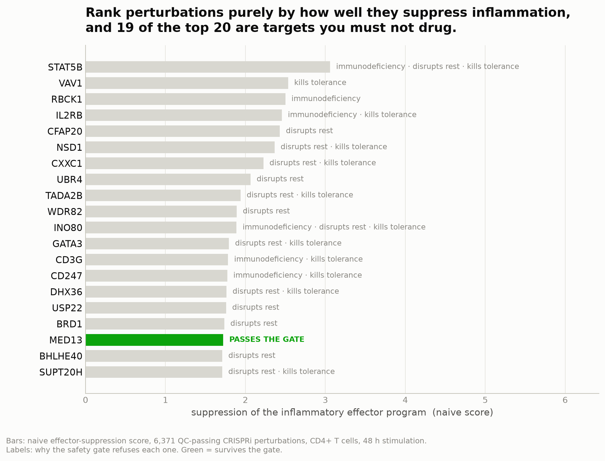
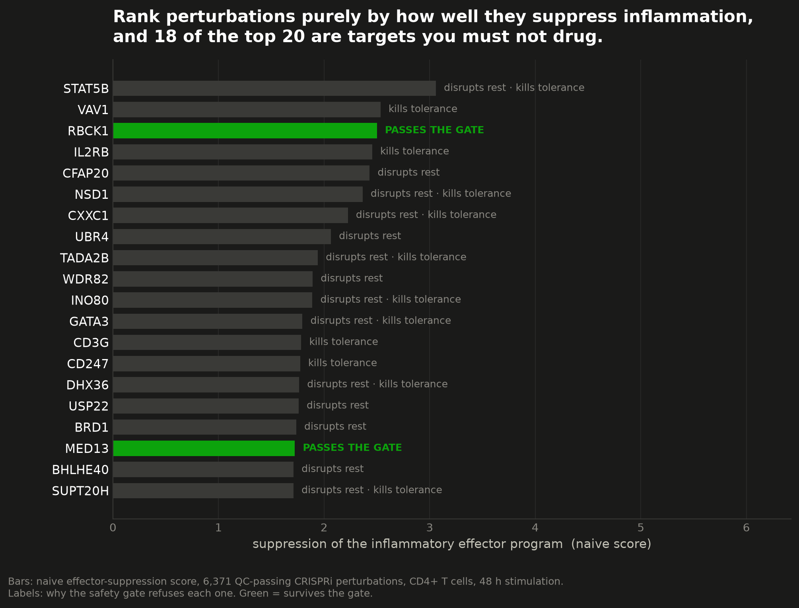
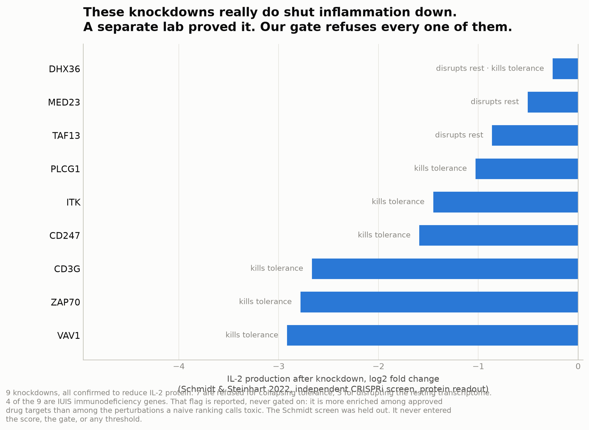
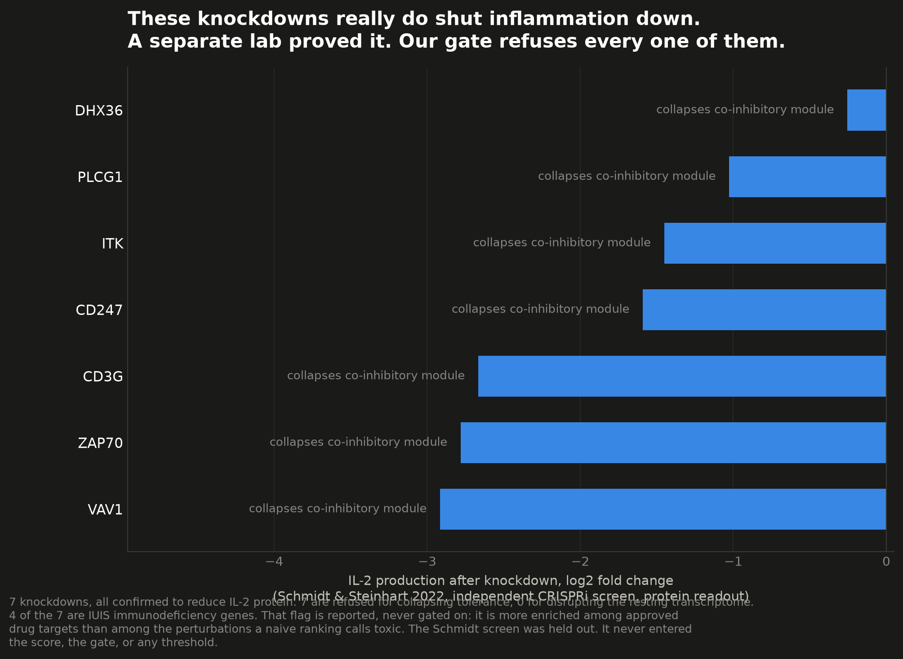
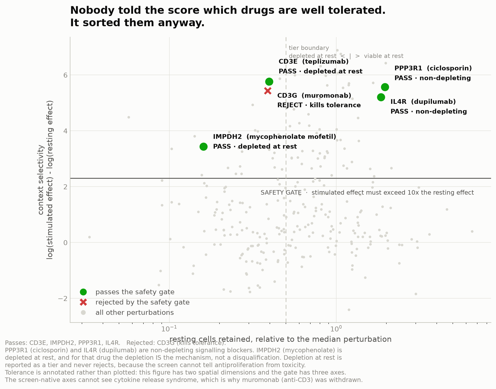
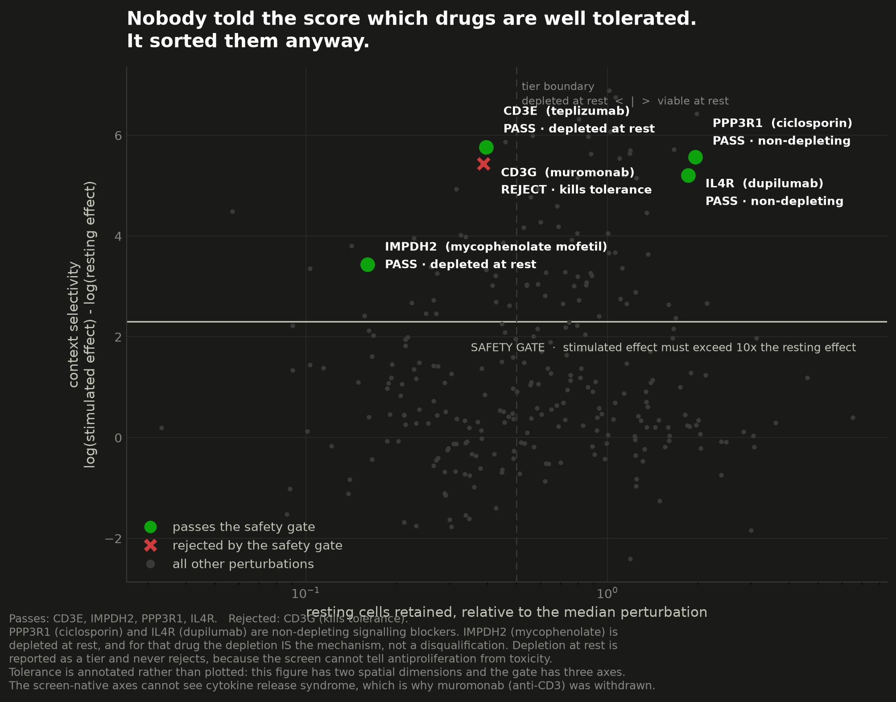

```{python}
#| tags: [setup]
import sys
from pathlib import Path

import numpy as np
import pandas as pd
from IPython.display import Markdown

REPO = Path.cwd().parent if Path.cwd().name == "reports" else Path.cwd()
sys.path.insert(0, str(REPO / "src"))

from cd4_perturbseq import priors  # noqa: E402

FIG = "../results/figures"

window = pd.read_csv(REPO / "results/tables/window_score.csv")
naive = pd.read_csv(REPO / "results/tables/risk_kill_naive_reversal.csv")
truth = pd.read_csv(REPO / "resources/ground_truth/immunomodulator_targets.csv")

schmidt = priors.schmidt_cd4_il2_screen()
w = window.merge(schmidt, on="gene_name", how="left")
w["il2_hit"] = (w["il2_neg_fdr"] < 0.05) & (w["il2_lfc"] < 0)
w["naive_rank"] = (-w["eff_mean_z"]).rank(ascending=False, method="first")

N_RANKABLE = len(window)
N_TOP20_REJECTED = int((~w.nsmallest(20, "naive_rank")["safe"]).sum())
POSITIVES = truth[truth["include_as_positive"]]["gene_symbol"]
```

# Introduction

A genome-scale CRISPRi Perturb-seq screen in primary human CD4+ T cells now exists, covering
`{python} f"{window['gene_name'].nunique():,}"` analysable perturbed genes across resting,
8-hour and 48-hour stimulated conditions. The obvious way to mine it for drug targets is to
rank perturbations by how strongly they reverse a disease signature. The authors have already
released a model that does this.

That approach has a failure mode that its own metrics cannot see. An essential gene whose
knockdown is cytotoxic also collapses an inflammatory signature, so it looks like a hit. So does
a gene at the heart of the T cell receptor, whose loss in a human being causes severe combined
immunodeficiency rather than remission. **Reversal is not enough.** The interesting object is not
the ranking; it is the gate that separates a drug target from a gene you must not touch.

Our contribution is the decision layer: a therapeutic-window score, a set of safety axes chosen
because the data supports them rather than because a database exists, and an honest account of
what the assay cannot see.

# Methods

## Data

We use the released per-perturbation effect matrix, `GWCD4i.DE_stats.h5ad`, holding 33,983
perturbation-by-condition pairs across 10,282 measured genes. Raw cells are not reprocessed.
Prior gene lists and reference screens come from the source paper's analysis repository.

After routine perturbation QC (dropping distal off-target and neighbouring-gene knockdown flags,
requiring significant on-target knockdown, and dropping low baseline target expression),
`{python} f"{N_RANKABLE:,}"` stimulated perturbations remain analysable.

## The activation program, and why tolerance is not part of it

The effector module is built from two independent sources: a curated immune effector list, and
genes significantly induced in an external bulk RNA-seq stimulation contrast. Only genes
supported by both enter the high-confidence core.

`FOXP3`, `IL10`, `IKZF2` and the co-inhibitory checkpoints are also induced by stimulation.
Suppressing them is a liability, not a benefit. They are therefore removed from the objective and
scored separately as a **tolerance module** whose suppression is penalised.

## The therapeutic-window score

Four requirements, applied in order.

1. **Evidence floor.** A perturbation must significantly suppress at least three effector-module
   genes at 10% FDR. Without this, perturbations that did nothing dominate the ranking; see
   @sec-failures.
2. **Context selectivity.** The stimulated effect must exceed the resting effect at least
   tenfold, measured in significant DE-gene counts. This threshold is fixed a priori.
3. **Immune essentiality.** Genes on the IUIS inborn-errors-of-immunity list are rejected.
4. **Tolerance preservation.** Perturbations in the top quartile of tolerance-module suppression
   are rejected.

For every perturbation, the perturbed gene is removed from both its own module and the
background, because its on-target knockdown is large, negative, and required to be significant by
QC. Twenty-one effector genes are themselves perturbed in this library, so this is not
hypothetical.

**Viability is read off the screen, not a database.** Cells carrying a guide against a gene the
cell cannot live without are simply absent. Hart core-essential genes are measurably depleted at
rest in this data, so resting cell count is the context-free viability signal. Depletion *only*
under stimulation is antiproliferation, which is mycophenolate's mechanism rather than a
disqualification, so viability is reported as a tier and does not reject.

## Validation discipline

The Schmidt and Steinhart 2022 genome-wide CRISPRi screen for CD4+ IL-2 production is a different
lab, a different assay, and a protein readout rather than a transcriptome. It is **held out**. It
never enters the score, the gate, or any threshold. Every number involving it is out of sample.

# Results

## A naive reversal ranking is toxic

```{python}
top20 = w.nsmallest(20, "naive_rank")
Markdown(
    f"Of the top 20 perturbations by naive effector suppression, **{N_TOP20_REJECTED} are "
    f"rejected** by the safety gate. The single survivor is "
    f"`{top20.loc[top20['safe'], 'gene_name'].iloc[0] if top20['safe'].any() else 'none'}`."
)
```

::: {.panel-tabset}

### The ranking

::: {.light-content}
{#fig-naive}
:::
::: {.dark-content}
{#fig-naive-dark}
:::

### They really work

::: {.light-content}
{#fig-rejected}
:::
::: {.dark-content}
{#fig-rejected-dark}
:::

### The rejected list

```{python}
rejected = w[w["il2_hit"] & ~w["safe"] & ~w["fail_evidence"]].sort_values("il2_lfc")
show = rejected[["gene_name", "stim_de_genes", "rest_de_genes", "il2_lfc", "reject_reason"]]
show.columns = ["gene", "DE genes (stim)", "DE genes (rest)", "IL-2 log2FC", "rejected for"]
show.round(2)
```

:::

The contaminants are of two kinds. Immune-essential signalling machinery: `STAT5B`, `VAV1`,
`IL2RB`, `CD3G`, `CD247`, `LCK`. And global transcription machinery that collapses the resting
transcriptome: `NSD1`, `TADA2B`, `CXXC1`, `WDR82`, `USP22`.

Crucially, these are not false positives in the sense of being wrong about efficacy. The held-out
Schmidt screen confirms that `ZAP70`, `CD3G`, `CD3E`, `CD28`, `CD247`, `ITK`, `PLCG1`, `VAV1` and
`PTPRC` knockdowns genuinely reduce IL-2 protein. They work. Loss of function of these genes in a
human being causes immunodeficiency.

## The score sorts approved drugs it was never told about {#sec-drugs}

```{python}
drugs = w[w["gene_name"].isin(POSITIVES) & ~w["fail_evidence"]].copy()
lookup = truth.set_index("gene_symbol")["drug_examples"].str.split(";").str[0]
drugs["drug"] = drugs["gene_name"].map(lookup)
cols = ["gene_name", "drug", "rest_cells_ratio", "viability_tier", "safe", "reject_reason"]
out = drugs[cols].sort_values("rest_cells_ratio", ascending=False).round(2)
out.columns = ["gene", "approved drug", "resting cells (x median)", "viability tier", "passes gate", "rejected for"]
out
```

::: {.panel-tabset}

### Gate geometry

::: {.light-content}
{#fig-gate}
:::
::: {.dark-content}
{#fig-gate-dark}
:::

### Held-out validation

```{python}
from sklearn.metrics import roc_auc_score

have = w["il2_lfc"].notna()
labels = w.loc[have, "il2_hit"].to_numpy()
rows = []
for label, col, sign in (("naive, -mean(module z)", "eff_mean_z", -1.0),
                         ("efficacy, -mean(module lfc)", "efficacy", 1.0),
                         ("window score", "window_score", 1.0)):
    values = np.nan_to_num(w.loc[have, col].to_numpy() * sign)
    rows.append({"score": label, "AUROC vs Schmidt IL-2 hits": round(roc_auc_score(labels, values), 3)})
pd.DataFrame(rows)
```

The window score does not beat the naive score here, and it must not. Schmidt's hits *are* the
TCR signalosome, which the gate rejects on purpose. Drug-target recovery and the Schmidt screen
validate the **efficacy axis**. Neither can validate the **window score**. A window score that
won those comparisons would be a window score that had stopped gating.

:::

Five approved-drug targets clear the evidence floor. The gate passes `PPP3R1` (ciclosporin,
tacrolimus) and `IL4R` (dupilumab), both non-depleting. It passes `IMPDH2` (mycophenolate) as
depleting-at-rest. It rejects `CD3E` and `CD3G`, which are inborn errors of immunity, and
muromonab was withdrawn.

Well-tolerated agents passing the gate: 3 of 3. Narrow-index agents passing: 0 of 2. Five points
is a direction, not a p-value, and we report it as one. Nothing in the score or the gate was told
which drug is well tolerated. The three strata that emerged are the three mechanism classes the
clinic uses.

## Where the designs failed {#sec-failures}

Three designs failed before this one worked, and the failures are more informative than the pass.

**No evidence floor.** Of the `{python} f"{N_RANKABLE:,}"` QC-passing perturbations,
`{python} f"{int((window['stim_de_genes'] <= 5).sum()):,}"` have five or fewer significant DE
genes genome-wide, and among those the maximum number of effector-module genes significantly down
is one. Ranking by a mean of z-scores let those perturbations dominate: `CAST` reached a score of
1.19 on two significant DE genes.

**Calibration was the wrong lever.** We hypothesised that co-regulation among effector genes
inflated the naive mean, and applied a CAMERA variance inflation factor. Estimated across all
perturbations the correlation is near zero; estimated among the 713 active perturbations it is
0.108. Either way the correction is near-uniform and barely reorders anything. Held-out AUROC went
from 0.701 to 0.689. It made things slightly worse. It is reported because it is honest.

**A collateral cap was backwards.** Capping the number of DE genes in stimulated cells rejects
precisely the context-selective targets this project exists to find. `ITK` carries 2,566 DE genes
in stimulated cells and 2 at rest. `PPP3R1` carries 523 and 1. Meanwhile `NSD1` carries 2,175 and
1,767. The discriminator is disruption **at rest**, never breadth in stimulated cells.

## Why calcineurin looked absent

`PPP3CA` produces one significant DE gene. `PPP3CB` produces three. Both are the target of
ciclosporin and tacrolimus, and both appear inert. `PPP3R1`, the obligate regulatory subunit,
produces 523.

The catalytic subunits are paralogues and compensate for one another. Single-gene CRISPRi cannot
see a redundant target. The shared, non-redundant regulatory subunit shows the phenotype. Any
drug-target-recovery benchmark on this data that does not account for redundancy will report a
false negative and blame the method.

# Discussion

The value of a perturbation atlas for drug discovery is not the regulator list. It is a
defensible, ranked, annotated shortlist that a laboratory can act on, together with an explicit
statement of what would have to be true for each entry to be wrong.

Our safety gate is not the one we planned. The original design anchored viability on DepMap and
Hart core-essential genes. In this screen that axis is inert: the 31 rankable Hart essentials sit
at median rank 3,148 of 6,371 in the naive ranking, Mann-Whitney p = 0.611. The axes that
actually separate the false positives are immune essentiality, resting-transcriptome disruption,
and tolerance preservation. Two of the three are computed from the knockdown transcriptome itself.

The shortlist that survives is dominated by immunometabolism: mitochondrial biogenesis, OXPHOS
assembly, one-carbon metabolism, and `RRAGC`, the Rag GTPase through which mTORC1 senses amino
acids, whose knockdown phenocopies rapamycin. Activated T cells are metabolically demanding and
resting T cells are quiescent, so these carry large stimulated effects and almost none at rest.
`IMPDH2`, an approved drug target of exactly this class, appears in the antiproliferative tier,
which is the internal control that the class is real.

`CD2` ranks second on the shortlist, is confirmed by the held-out screen, and is the target of
alefacept, an approved drug. It is not in our curated ground truth. We did not add it. Adding a
positive to the gold standard after watching it rank second is tuning the benchmark to the
result. An independent Open Targets query is the appropriate way to establish whether we missed
it, and that query is pending.

# Limitations

- **The safety gate is T-cell-intrinsic, not organism-level.** "Rest" here means resting CD4 T
  cells. Mitochondrial and one-carbon genes would be toxic to gut epithelium and bone marrow, and
  this screen cannot see that. The shortlist needs a tissue-breadth axis before anyone acts on it.
- **The assay is blind to cytokine-signalling targets.** The screen stimulates through the T cell
  receptor with no exogenous polarising cytokines, so `JAK2`, `TYK2`, `IL4R` and `S1PR1` have
  little to suppress. This bounds recall from above and is a property of the dataset.
- **The drug-recovery benchmark is underpowered.** Of 36 curated positives, 32 are perturbed, 30
  are measured, 20 survive QC and only 5 clear the evidence floor. `JAK1` and `JAK3` were never
  perturbed. AUROC on the 20 rankable positives is 0.542, 95% CI [0.373, 0.707], which covers
  chance.
- **`n` = 5** for the therapeutic-index result.
- **Single-gene library.** No combinatorial perturbations, and no visibility into redundant
  targets, as calcineurin demonstrates.
- **Pseudobulk differential expression**, inherited from the released matrices. Not distribution
  aware.
- **Cell count is confounded with guide representation.** We have no time-zero library
  measurement, so the viability tier is a strong signal rather than a clean measurement.

# Reproducibility

Every number in this report is computed from two committed tables,
`results/tables/window_score.csv` and `results/tables/risk_kill_naive_reversal.csv`, neither of
which exceeds 600 KB. The 16.8 GB effect matrix is needed only to regenerate them.

```bash
uv sync
bash scripts/fetch_priors.sh
uv run python scripts/01_build_activation_program.py
uv run python scripts/02_risk_kill_reversal.py   # exits non-zero if the headline claim fails
uv run python scripts/04_window_score.py
uv run python scripts/05_figures.py
quarto render reports/report.qmd
```

`scripts/02_risk_kill_reversal.py` is written so that it can fail. If the naive ranking is no more
toxic than a cell-count-matched background, it exits non-zero and this report's central claim is
wrong.

# How Claude was used

Claude Code planned the work, wrote and ran the pipeline, and then attacked its own results with a
six-lens adversarial audit, each finding independently refuted or reproduced by two further
agents. The failures in @sec-failures were caught that way, or by rendering a figure and looking
at it: the first version of @fig-naive ranked ascending and crowned the perturbations that
*raised* the inflammatory program.

Claude Science was given the tasks that could break the result rather than decorate it. It
independently recomputes the risk-kill statistics, including resampling a cell-count-matched
background that Claude Code drew only once, and it queries Open Targets for the approved-drug
positives our hand curation missed. Where it corrects Claude Code, the disagreement is logged.

The full audit trail is `docs/claude_tooling_log.md`.
